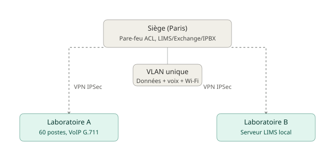

# Étape 1 — Caractérisation des flux et analyse réseau

## Contexte

Données trafic fournies par l'équipe IT de MediLab :
- Heures de pointe : 9h-11h et 14h-16h (80 % du trafic)
- Volume quotidien : 50 Go échangés entre laboratoires et siège
- Téléphonie : 60 postes VoIP, codec G.711 (87 kbps/appel)
- Liaisons WAN : Fibre 100 Mbps par site, VPN IPSec.

## Travail réalisé

### 1. Classification des flux
Classification des flux MediLab (téléphonie IP, application LIMS, messagerie Exchange, partage de fichiers, sauvegardes, navigation web) selon leur type (temps réel / interactif / transactionnel / bulk), leur protocole/port et leur priorité QoS.

Flux	Type	Proto/Port	Priorité QoS
Téléphonie IP|          |           |           |			
Application LIMS|        |          |          |		
Messagerie Exchange|        |          |          |			
Partage fichiers|          |            |            |			
Sauvegardes|        |          |          |
Navigation web|            |            |            |

### 2. Calcul de bande passante VoIP
Calcul du nombre d'appels simultanés en heure de pointe, de la bande passante VoIP nécessaire, et vérification de la suffisance de la liaison 100 Mbps.

### 3. Matrice de flux
Construction de la matrice de flux (source, destination, protocole/port, description, criticité) pour les échanges clés (postes labo ↔ Srv-LIMS, téléphonie IP ↔ IPBX, Srv-LIMS ↔ Sécurité Sociale, etc.).

### 4. Plan VLAN
Proposition d'un plan VLAN pour un laboratoire type (nom, plage IP, équipements rattachés).

### 5. Analyse VPN
Analyse de l'architecture VPN IPSec actuelle (avantages/inconvénients), proposition de solution pour le télétravail des biologistes, et comparatif IPSec vs SSL VPN selon les usages (liaison labo-siège, télétravail, accès partenaires).

### 6. Schéma d'architecture (bonus)
Schéma simplifié de l'architecture réseau MediLab existante (siège, 2 laboratoires, VPN, serveurs principaux, flux critiques) :

## Livrables

- [ ] Tableau de classification des flux
- [ ] Calcul de bande passante VoIP
- [ ] Matrice de flux complète
- [ ] Plan VLAN laboratoire
- [ ] Recommandation technologie VPN par usage
- [ ] Schéma d'architecture existant
