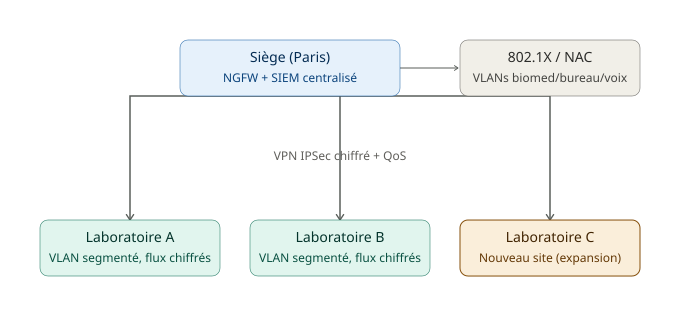

# Étape 3 — Conception de l'architecture cible

## Contexte

Suite à l'audit, la direction demande une **architecture réseau cible** répondant aux problèmes identifiés et permettant l'expansion vers 3 nouveaux laboratoires dans les 2 prochaines années.

**Contraintes :**
- Budget WAN : 3 000 €/mois maximum pour l'ensemble des sites
- SIL (système d'information de laboratoire) : temps de réponse < 200 ms, disponibilité 99,99 %
- Conformité HDS : segmentation réseau obligatoire pour les données de santé
- 3 nouveaux laboratoires à intégrer (15-25 postes chacun)

---

## 1. Dimensionnement des liens WAN

### Données de trafic — Site A (Siège, 40 utilisateurs, 15 équipements biomed.)

| Application | Flux simult. | Débit/flux | Direction | Criticité |
|---|---|---|---|---|
| SIL (transactions) | 30 | 50 kbps | Bidirectionnel | Critique |
| Transfert DICOM | 3 | 8 Mbps | Upload | Haute |
| VoIP (G.711) | 10 | 100 kbps | Bidirectionnel | Critique |
| Vidéoconférence | 2 | 3 Mbps | Bidirectionnel | Moyenne |
| ERP / Web interne | 25 | 200 kbps | Download | Moyenne |
| Messagerie / Internet | 30 | 150 kbps | Bidirectionnel | Basse |
| Sauvegarde (nuit) | 1 | 50 Mbps | Upload | Basse |

### Calcul de la bande passante en heure de pointe (hors sauvegarde nocturne)

```
BP = Σ (débit/flux × nb flux simultanés)
BP = (0,05×30) + (8×3) + (0,1×10) + (3×2) + (0,2×25) + (0,15×30)
BP = 1,5 + 24 + 1 + 6 + 5 + 4,5 = 42 Mbps

Avec coefficient de sécurité 1,3 : 42 × 1,3 = 54,6 Mbps
```

### Capacité de lien à commander selon la technologie

| Technologie | Rendement | Calcul | Capacité à commander |
|---|---|---|---|
| MPLS | 92% | 54,6 / 0,92 | **60 Mbps** |
| VPN IPSec | 75% | 54,6 / 0,75 | **73 Mbps** |

**Conclusion :** le MPLS nécessite moins de bande passante brute (moins d'overhead lié au chiffrement) — technologie privilégiée pour les flux critiques.

### Répartition du trafic entre lien MPLS et lien SD-WAN/Internet

| Lien MPLS | Lien SD-WAN/Internet |
|---|---|
| SIL (transactions) | ERP / Web interne |
| VoIP | Messagerie |
| Transfert DICOM | Internet |
| | Vidéoconférence |

**Justification :** les flux nécessitant une latence faible et une QoS garantie contractuellement (SLA) — criticité *critique* et *haute* — sont routés sur le lien MPLS. Les flux de criticité *moyenne* et *basse* sont routés sur le lien SD-WAN/Internet, moins coûteux et sans garantie de SLA.

---

## 2. Plan d'adressage et segmentation VLAN

**Contraintes :** supernet `10.0.0.0/8`, 6 sites (3 existants + 3 nouveaux), 5 types de VLAN minimum par site, réserve de 50% d'adresses, isolation stricte du VLAN biomédical (conformité HDS).

### Plan d'adressage — Site Siège (Site A)

| VLAN ID | Nom | Sous-réseau | Passerelle | Plage DHCP | Nb hôtes max |
|---|---|---|---|---|---|
| 10 | Biomédical | 10.0.0.0/25 | 10.0.0.1 | 10.0.0.2 – 10.0.0.126 | 126 |
| 11 | Bureautique | 10.0.0.128/25 | 10.0.0.129 | 10.0.0.130 – 10.0.0.254 | 126 |
| 12 | VoIP | 10.0.1.0/25 | 10.0.1.1 | 10.0.1.2 – 10.0.1.126 | 126 |
| 13 | IoT Médical | 10.0.1.128/25 | 10.0.1.129 | 10.0.1.130 – 10.0.1.254 | 126 |
| 14 | Serveurs | 10.0.2.0/25 | 10.0.2.1 | 10.0.2.2 – 10.0.2.126 | 126 |
| 999 | Management | 10.0.2.128/25 | 10.0.2.129 | 10.0.2.130 – 10.0.2.254 | 126 |

**Justification du masque /25 :** offre 126 adresses utilisables par VLAN, suffisant pour le site Siège tout en garantissant la réserve de croissance de 50% exigée. La segmentation stricte du VLAN biomédical (10) répond directement à l'exigence HDS d'isolement des données de santé.

---

## 3. Politique QoS et schéma d'architecture cible

### Politique QoS

| Application | Classe DSCP | File d'attente | % bande | Politique perte | Lien associé |
|---|---|---|---|---|---|
| VoIP | EF (Expedited Forwarding) | Priority Queue (PQ) | 15% | Aucune perte tolérée | MPLS |
| SIL (transactions) | AF41 | CBQ haute priorité | 25% | Perte quasi nulle (WRED léger) | MPLS |
| DICOM | AF31 | CBQ priorité moyenne-haute | 20% | Tolérance faible | MPLS |
| Vidéoconférence | AF21 | CBQ priorité moyenne | 15% | Tolérance faible | SD-WAN/Internet |
| ERP / Web | AF11 | CBQ priorité standard | 15% | Tolérance modérée | SD-WAN/Internet |
| Internet / Mail | BE (Best Effort) | File par défaut | 10% | Tolérance élevée | SD-WAN/Internet |

### Schéma d'architecture cible



---

## Livrables

- [x] Dimensionnement des liens WAN par site
- [x] Plan d'adressage IP et VLAN
- [x] Schéma d'architecture cible
- [x] Politique QoS
